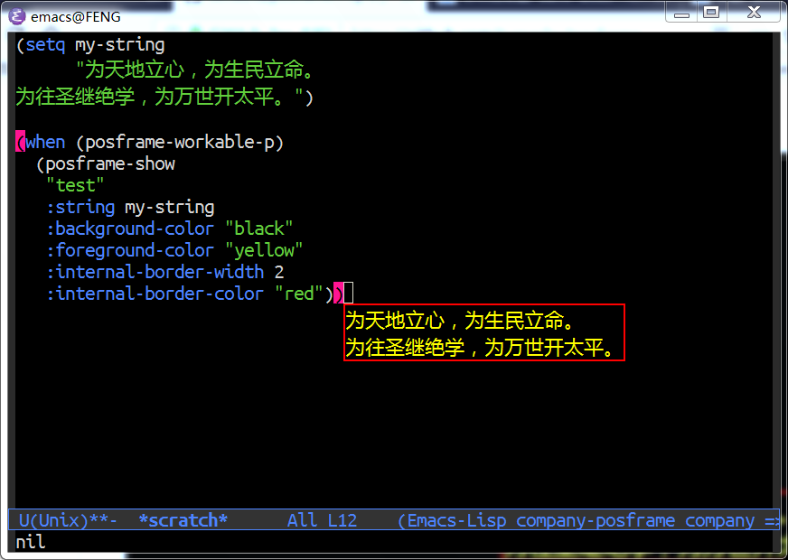

Note: this file is auto converted from posframe.el by [el2org](https://github.com/tumashu/el2org), please do not edit it by hand!!!

# &#30446;&#24405;

1.  [Posframe README](#org3c803d7)
    1.  [What is posframe](#orge01c383)
    2.  [Installation](#org0e86f77)
    3.  [Usage](#orged3f863)
        1.  [Create a posframe](#org675e151)
        2.  [Hide a posframe](#orgb91d9ff)
        3.  [Hide all posframes](#org9ad2afb)
        4.  [Delete a posframe](#org62bd3a2)
        5.  [Delete all posframes](#org10ff130)

# Posframe README

## What is posframe

Posframe can pop a posframe at point, this **posframe** is a
child-frame with its root window's buffer.

The main advantages are:

1.  It is fast enough for daily usage :-)
2.  It works well with CJK language.

NOTE: For MacOS users, posframe need Emacs (version >= 26.0.91)

## Installation

    (require 'posframe)

## Usage

### Create a posframe

1.  Simple way

        (when (posframe-workable-p)
          (posframe-show " *my-posframe-buffer*"
                         :string "This is a test"
                         :position (point)))

2.  Advanced way

        (defvar my-posframe-buffer " *my-posframe-buffer*")
        
        (with-current-buffer (get-buffer-create my-posframe-buffer)
          (erase-buffer)
          (insert "Hello world"))
        
        (when (posframe-workable-p)
          (posframe-show my-posframe-buffer
                         :position (point)))

3.  Arguments

        C-h f posframe-show

### Hide a posframe

    (posframe-hide " *my-posframe-buffer*")

### Hide all posframes

    M-x posframe-hide-all

### Delete a posframe

1.  Delete posframe and its buffer
    
        (posframe-delete " *my-posframe-buffer*")
2.  Only delete posframe's frame
    
        (posframe-delete-frame " *my-posframe-buffer*")

### Delete all posframes

    M-x posframe-delete-all

Note: this command will delete all posframe buffers,
suggest not run this command if you are sharing a buffer
between posframe and other packages.

